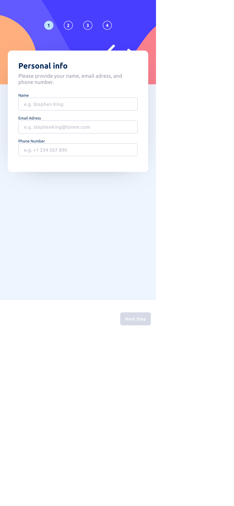
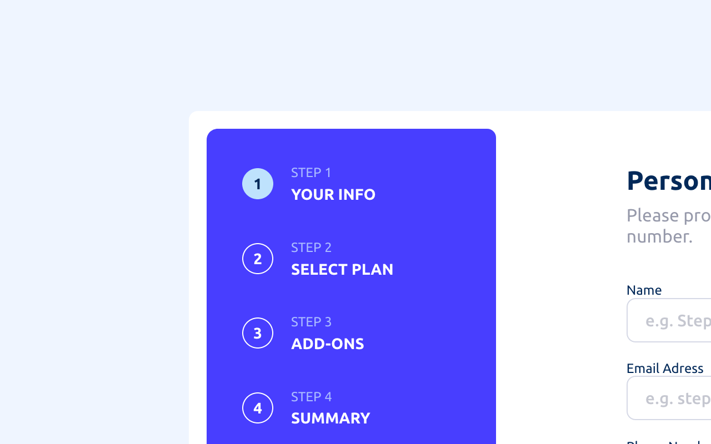

# Frontend Mentor - Multi-step form solution

This is a solution to the [Multi-step form challenge on Frontend Mentor](https://www.frontendmentor.io/challenges/multistep-form-YVAnSdqQBJ). Frontend Mentor challenges help you improve your coding skills by building realistic projects. 

## Table of contents

- [Overview](#overview)
  - [The challenge](#the-challenge)
  - [Screenshots](#screenshots)
  - [Links](#links)
  - [Built with](#built-with)
  - [What I learned](#what-i-learned)
  - [Continued development](#continued-development)

## Overview

### The challenge

Users should be able to:

- Complete each step of the sequence
- Go back to a previous step to update their selections
- See a summary of their selections on the final step and confirm their order
- View the optimal layout for the interface depending on their device's screen size
- See hover and focus states for all interactive elements on the page
- Receive form validation messages if:
  - A field has been missed
  - The email address is not formatted correctly
  - A step is submitted, but no selection has been made

### Screenshots
- Mobile Preview

- Desktop Preview

### Links

- Solution URL: [Add solution URL here](https://www.frontendmentor.io/solutions/my-first-spa-using-react-MF7p5jn6uB)

- Live Site URL: [Add live site URL here](https://lepamoore.github.io/multi-step-form/)

### Built with

- Semantic HTML5 markup
- CSS custom properties
- Flexbox
- Mobile-first workflow
- [React](https://reactjs.org/) - JS library

### What I learned

Since this is my first React App i just noticed shortly before i finished the project that i barely used the lifecycle methods of react.
The lifecycle methods would´ve been so helpful and i would've managed some tasks much faster than i did without them. 
I won't forget them so fast again...

### Continued development

Like i mentioned above i want to include the lifecycle methods more into my react projects.

